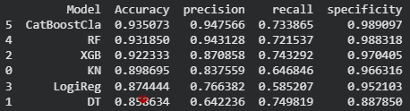
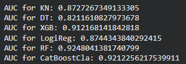
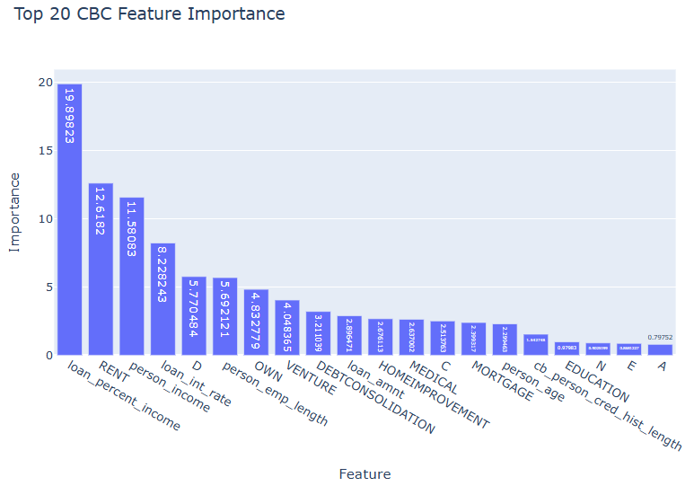

# 🏦 Credit Risk Prediction & Analysis


[To see the code on Device](https://nbviewer.org/github/PietUsl/Credit-Risk/blob/main/scripts/credit_risk.ipynb)

## 📌 Project Overview

Credit risk assessment is a crucial task for financial institutions. This project aims to build a robust machine learning and statistical pipeline to predict the probability of default (PoD) for loan applicants.

By leveraging historical financial data, the analysis can classify new individuals, identifing a correct classification of Default (1) and Not Default (0), and optimizing the decision-making process for loan approvals.

## 📊 Dataset

[Kaggle Dataset, by "LAO TSE"](https://www.kaggle.com/datasets/laotse/credit-risk-dataset/code?datasetId=688532&sortBy=voteCount)

The dataset contains various informations on **32581** applicants with **12** features, including demographic data, financial status, and the target variable (`loan_status`).

- **Target Variable:** `1` (Default / High Risk) vs `0` (Fully Paid / Low Risk).
- **Challenge:** The dataset is highly imbalanced, with defaults representing only **21.8%** of the total samples.

---

## 🔬 Methodology & Workflow

### 1. Exploratory Data Analysis (EDA)

- Analyzed feature distributions and correlated variables using **Seaborn** and **plotly.express**.
- Investigated the relationship between applicant income, loan amount, and default rates.
- Addressed outliers and handled missing values by imputating median values (to get more stable values).

### 2. Feature Engineering & Preprocessing

- **Encoding:** Applied One-Hot Encoding for categorical variables.
- **Scaling:** Standardized continuous features using `StandardScaler` to ensure optimal performance for distance-based and gradient descent-based algorithms.
- **New Variables:** New variables are created, to get more useful informations from our variables

### 3. Predictive Modeling

Trained and evaluated multiple algorithms to find the best fit for the data.

Advanced models evaluated include:

- **Logistic Regression** (Baseline)
- **Random Forest Classifier**
- **XGBoost Classifier**
- **CatBoosClassifier** (Best Performer)

---

## 📈 Results & Evaluation

In credit risk, False Negatives (predicting a defaulter as a good customer) are extremely costly. Therefore, the models were optimized and evaluated primarily on **Recall** and **ROC-AUC**, rather than standard Accuracy.



_Key Finding:_ CatBoostClassifier outperformed other models in terms of Accuracy and Specificity



On the other hand, `RF` model performed better. This means that the probability of correct guess to a True Positive is higher than a wrong guess.

**Important note**: While ensemble models typically achieve the highest predictive performance in classification tasks, they operate as 'black boxes.' Because their predictions are generated by aggregating multiple base models (such as decision trees), it is difficult to isolate and analyze the exact impact of individual variables.

Conversely, Logistic Regression offers a highly transparent approach. It allows us to conduct specific, granular analyses by interpreting individual coefficients and rigorously testing statistical assumptions.

### CatBoostClassifier results



### Conclusion: Feature Importance Hierarchy

The distribution of feature importance shows a clear hierarchy of influence contributing to the model's decision-making process:

- **Primary Driver**: `loan_percent_income` is the most dominant feature by a significant margin. This suggests that the relative financial burden of the loan compared to the applicant's earnings is the strongest predictor of default.

- **Economic Stability**: Factors such as `RENT`, `person_income`, and `loan_int_rate` follow closely. This indicates that the model heavily weighs the applicant's cash flow, housing situation, and the direct cost of the loan.

- **Secondary Factors**: `person_emp_length` and specific categories like `D` (credit grade) show moderate importance, while demographic factors like `person_age` have the least impact among the top 20 drivers.

## 🛠️ Tech Stack

- **Language:** Python
- **Data Manipulation:** `pandas`, `numpy`
- **Data Visualization:** `matplotlib`, `seaborn`, `plotly.express`
- **Machine Learning:** `scikit-learn`, `xgboost`, `randomforest`

## 🚀 How to Run the Project

1. Clone this repository:
   ```bash
   git clone [https://github.com/PietUsl/credit-risk-analysis.git](https://github.com/PietUsl/credit-risk-analysis.git)
   ```
